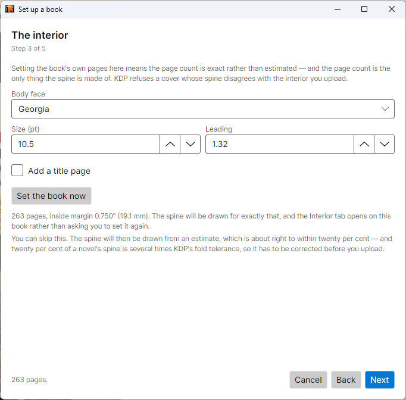
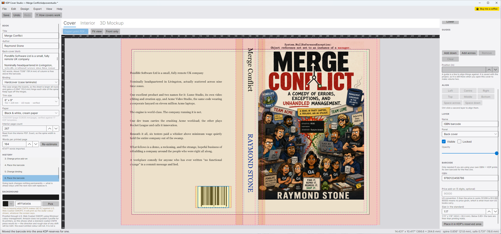
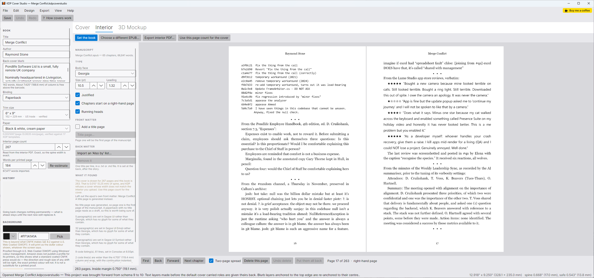
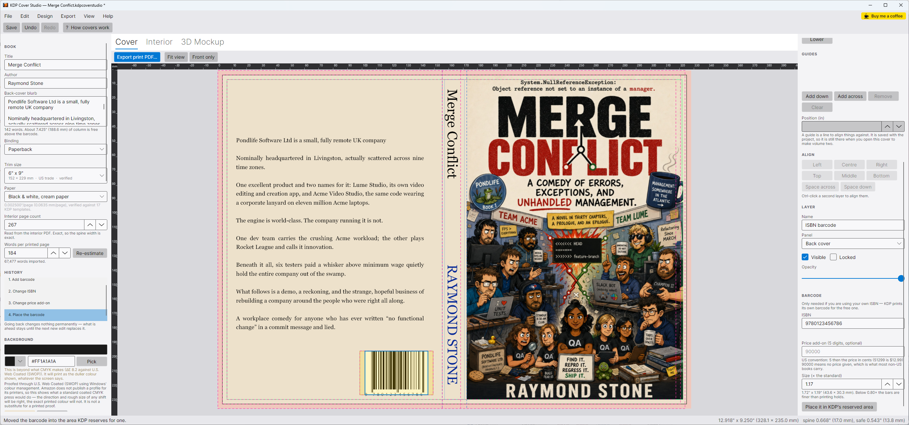
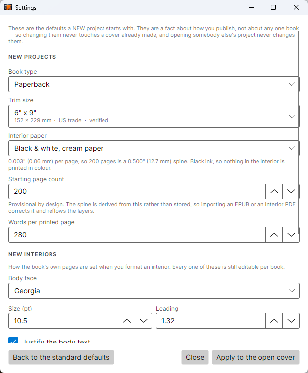
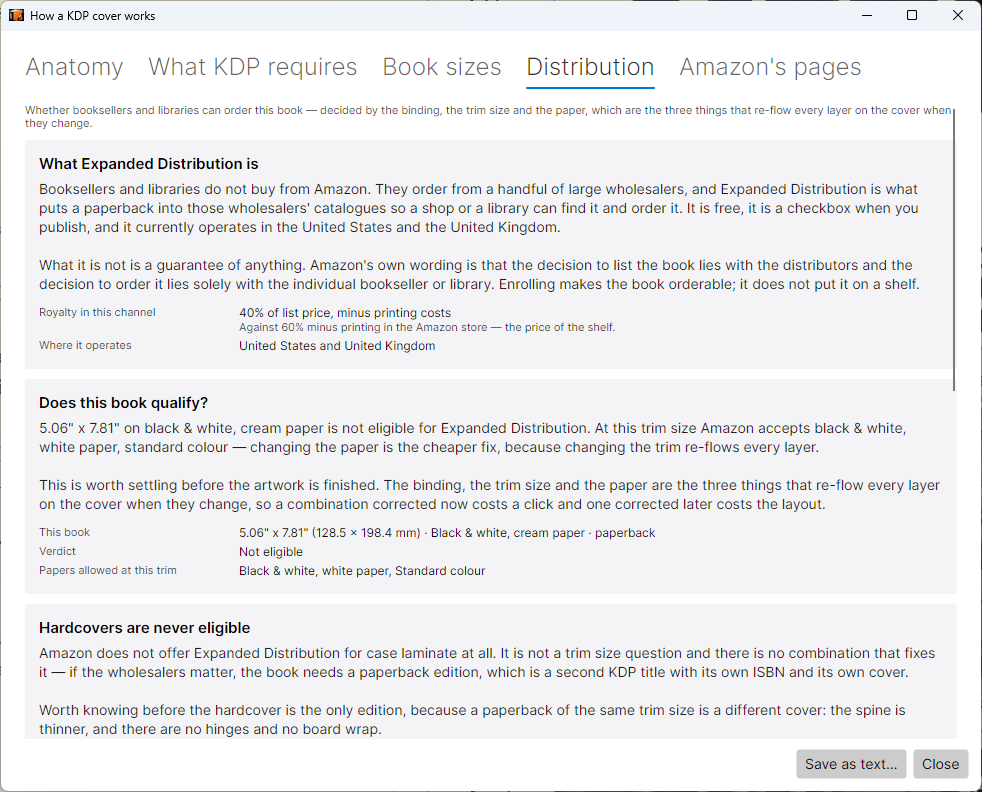
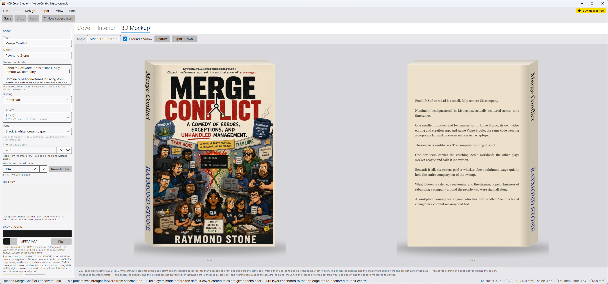
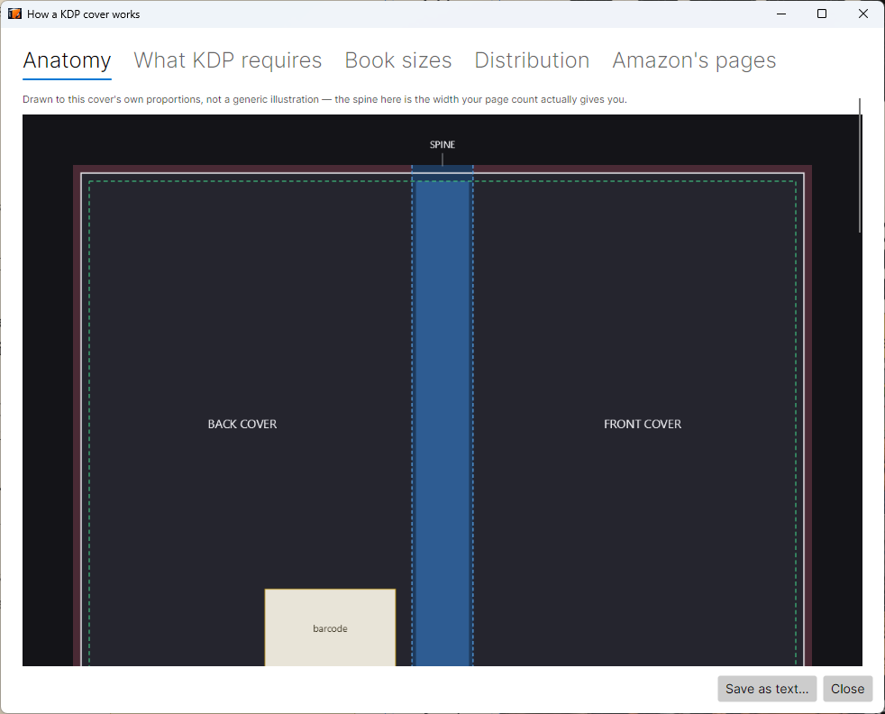

# KDP Cover Studio

A Windows desktop app that formats a book **inside and out** — the print-ready KDP cover, with back, spine and front as a single wrap, and the book's own typeset pages — and exports the two files KDP asks for. A guided setup takes an EPUB to both.

**[Download the latest release »](https://github.com/raymondjstone/KDP-Cover-Studio/releases/latest)**


---

## From a manuscript to both files, in five steps



**File ▸ Set up a book from an EPUB…** asks five questions and nothing else: the manuscript, the book, the interior, the cover, and what it made.

It exists because of the failure the interior formatter was written after: **two KDP rejections in one afternoon, both a cover whose spine disagreed with the interior that was uploaded**. The spine is made of the page count and nothing else, and until the pages are actually set, the page count is an estimate. So the wizard sets the book's own pages first, and the cover it then draws is drawn for that exact number.

| Step | What it settles |
|---|---|
| **The manuscript** | An EPUB supplies the title, the author, the blurb and the length. You can go on without one and type the title yourself |
| **The book** | Binding, trim size and paper — the three fields that re-flow every layer, so they are asked before anything is drawn. They start as your defaults |
| **The interior** | Body face, size, leading, an optional title page. Press *Set the book now* and the page count stops being an estimate |
| **The cover** | A design, the EPUB's own artwork, and the option to draw the wrap's background colour out of that artwork so the three panels read as one book |
| **What it made** | A summary. **Nothing has been written to disk** — the cover opens in the editor and saving is yours to do |

Every step is skippable and nothing it sets is final: what comes out is an ordinary project, in the ordinary editor, with ordinary layers. And the book it composed is **handed to the Interior tab rather than thrown away**, so the tab opens on the pages you have just seen counted instead of asking for the manuscript a second time.

The same pipeline runs from the command line, because a batch processor with its own generation logic would drift from the app it automates:

```
KDPCoverStudio.exe book.epub --interior --size 6x9 --paper cream --out folder
```

An EPUB path is what selects batch mode — a bare path is also how Windows hands over a double-clicked project, and that has to open the editor rather than start a silent export. Preflight still decides what may be written, every problem is reported rather than just the first, and the project file is written first and always, because it is the one output somebody can open and correct.

---

## What it does

The window is three views of one project — **Cover**, **Interior** and **3D Mockup** — not three programs. They share the book: the trim, the paper and the page count sit down the left of all three, because those are the book itself and everything on every tab is derived from them.

On the Cover tab you set the binding, the trim size, the paper and the interior page count. The app derives the wrap geometry from those — spine width, bleed, safe areas, fold tolerance, hinges, barcode reserve — and draws it to scale. You drag artwork onto a panel, set the type, and export.


The geometry is not estimated. It is derived from Amazon's own cover template PDFs and verified continuously against a corpus of **39 of them**, covering both bindings, five paper stocks and seven trim sizes. Every figure in this README is re-derived on each test run; none of it is transcribed from documentation unless it says so.

### Getting the spine right

`spine width = page count × paper caliper`. For KDP's black-and-white white paper that caliper is **0.002252 inches per page**, identical to seven decimal places across all 21 B&W-white templates in the corpus.

Several popular online spine calculators add a "+0.06 inch cover allowance". Amazon's own templates do not, and adding it shifts spine text visibly off-centre. This app does not add it.

The binding constraint on spine text is the **safe** width, not the spine width. A 200-page paperback has a 0.450" spine but only 0.325" you can actually set type in. The status bar shows both, always.

**Every paper stock is now sampled at three page counts or more**, up to 800 pages:

| Stock | Caliper (in/page) | Page counts sampled |
|---|---:|---:|
| B&W white | 0.002252 | 20 |
| B&W cream | 0.0025 | 4 |
| B&W groundwood | 0.00235 | 3 |
| Standard colour | 0.002252 | 3 |
| Premium colour | 0.002347 | 3 |

The page-count column is the one that matters, not the template count. A caliper measured at a single page count is exact for that book and cannot tell `pages × c` from `pages × c′ + offset` — twenty templates at one page count would still be one point on a line.

### Hardcover is a different shape, not a bigger paperback



A case laminate cover wraps rigid boards, so the printed sheet is larger than the book in every direction and gains a **hinge** each side of the spine where the case flexes. Nothing readable may go there — it is not merely unsafe like the spine's fold tolerance, it is a crease with no board behind it, in a known place, on every copy. The editor draws the hinges and preflight enforces them.

**KDP specifies hardcover in millimetres**, and that is not a presentational detail. Every distance came out of the template as a round metric figure — 15 mm of wrap, 10 mm of hinge, 5 mm of board inset, 6 mm of overhang. Expressing them as rounded inches instead put the spine fold out by 0.007 pt, which the acceptance gate caught.

**The spine board allowance is no longer inferred.** A case laminate spine is `allowance + pages × caliper` — one template is one equation in two unknowns, so earlier versions had to assume the paper contributed what it does in a paperback, and said so. The corpus now holds two case laminates on the same stock at different page counts, which is the second equation: the caliper falls out as exactly 0.0025 in/page and the board allowance as **4.8 mm**. All six case laminates agree, across three stocks, three trim sizes and three page counts.

**KDP prints hardcovers at five trim sizes only** — 5.5 × 8.5, 6 × 9, 6.14 × 9.21, 7 × 10 and 8.25 × 11". Switching an existing paperback to hardcover used to leave you with a book KDP will not print, drawn perfectly, with nothing on screen to say so. The trim picker is now two lists, and a size the chosen binding cannot use is an error that names the five.

### Trim sizes have names, and not all of them print

The default is 5.06" × 7.81" — the **UK B-format paperback**, 129 × 198 mm. The picker says so, because an author looking for a standard UK paperback is looking for "B-format", not for an inch figure that is an artefact of KDP being a US service. A5, UK Royal and A4 are named on the same basis.

A **Book sizes** tab answers the question in the other direction, and its useful half is the sizes **KDP does not print** — a list of available sizes can never tell you that. A format, the small mass-market paperback, has no KDP equivalent at all; neither do Penguin, Royal octavo wide or American narrow. The nearest KDP trim is computed against the picker's own list rather than written down, so the two cannot drift apart.

**A5 is the row that needs three answers rather than two.** KDP's 5.83 × 8.27" is A5 to within a tenth of a millimetre — and is printed only through kdp.amazon.co.jp. So it is neither blocked nor silent: a warning whose wording says the cover is correct and the marketplace is the constraint. In hardcover it is an error again, because Japan's list is a paperback list.

Every dimension on screen carries both units: `0.450" (11.4 mm)`. There is no units toggle — a cover is designed against inch-denominated rules and printed to a paper size named in millimetres, so both numbers are wanted.

---

## The book's own pages



The **Interior** tab lays out the manuscript itself: choose the EPUB, pick the face and the size, set the book, page through it, export the PDF. It used to be a dialog reached from a menu, which was the wrong shape — the interior is half of what gets uploaded, and the page count it produces is the number the cover's spine is made of. As a tab it keeps its state, and the manuscript it uses is the project's own.

**The button that matters is "Use this page count for the cover".** A count that comes out of the file this app has just written is exact by construction, and it arrives marked as exact, so nothing downstream treats it as a guess.

### The gutter is a fixed point

KDP's inside margin steps with the page count — a thicker book does not open as flat — so the margin depends on the length, and the length depends on the margin. There is no closed form, so the formatter iterates: compose, ask what gutter that many pages needs, compose again if the answer changed. A narrower column is always longer, so the iteration is monotone and comes to rest; the guard against oscillation is there anyway, and takes the **wider** gutter if one comes round twice, because KDP's figure is a minimum and more is always acceptable.

Most books settle on the first pass — the default layout's own gutter is 0.75" and KDP's step only exceeds it past 500 pages. The iteration exists for the long ones, which are exactly the books where getting it wrong costs the most.

### What it sets

| | |
|---|---|
| **Front matter** | The EPUB's own is dropped and the book gets its own, so a half-title left over from an ebook does not print. An optional **title page designer** carries the title, subtitle, author, series line, imprint and copyright page — seeded from the project, all of it editable. The app writes the year and the convention and never somebody's rights paragraph |
| **Back matter** | An **"Also by" list**, imported from a `.txt` or `.md` file — one title per line. It belongs to the author rather than to this book, so it lives in one file and every book picks it up on the way to the printer. Markdown is stripped rather than honoured, because the interior carries no styling and the asterisks would print |
| **Pictures** | Resolved relative to the document that names them, not to the book — matching on filename alone finds the wrong picture the moment two chapters both have a `fig1.jpg` |
| **Type it cannot draw** | A face without a glyph is reported, and the run is drawn from a face that has it rather than printing `.notdef` |
| **Two-page spreads** | The only way to see the faults worth seeing — a blank in an awkward place, a chapter opening on the wrong side, a heading stranded at a turn. Page one is a recto, so the first spread has nothing on its left |
| **Deleting a page** | Subtractive rather than a re-flow, and the renumbering **turns every page after it over**: the gutter moves to the other edge and the running head changes sides. That is what happens in a real book |

**And it can check an interior PDF, including one made elsewhere.** Page count against the cover's — judged by the fold error, which is what KDP actually refuses over — page size against trim and trim-plus-bleed, one page size throughout, the page limit for the binding and paper, and an odd page count, which KDP silences by adding a blank *after* whatever the author thought was the last page. The gutter minimum is stated rather than measured: finding the text block on a page carrying a running head, a folio and a drop cap is guesswork, and being wrong reports a good book as broken.

Where both can be run, this is the stronger of the two checks — an interior PDF states its page count, while a cover PDF only lets one be recovered to within a page or two.

---

## Features

### Page count without guessing

| Source | Accuracy |
|---|---|
| The interior this app sets | Exact by construction — it counted the pages it wrote |
| An interior PDF | Exact, authoritative — read straight from the file |
| EPUB estimate | A **range**, never a bare number |
| Manual | Whatever you enter |

An EPUB does not contain the typography that determines page count, so an estimate carries ±20%. On a 300-page book that is ±0.135" of spine — more than double the fold tolerance. The app shows a range, keeps words-per-page editable and calibratable, and never lets an estimate look settled. An unconfirmed count is asked about once, at the point it starts to matter.

**KDP rejects a file over its page limit**, and the limit depends on the binding and the paper. The app says the number out loud rather than letting you discover it at upload. A book over the maximum can be **split into volumes**: the splitter proposes page ranges and can build a series from them, but does not touch your manuscript, because where a book should break is an editorial judgement. Given an EPUB it splits at document boundaries — most EPUBs put one chapter in one document, so the breaks are real ones. Volumes come out deliberately uneven: a reader notices a chapter cut in half and never notices thirty pages of difference.

**The interior's bleed rule is not the cover's**, and the asymmetry is the part that costs money. A cover gets 0.125" of bleed on all four outer edges; an interior with bleed gets it on **three** — the inside edge runs into the binding and is never trimmed. Read 0.125" once and apply it everywhere and a 6 × 9" interior comes out a quarter of an inch too wide, which KDP silently resizes, moving every margin. The app measures the interior PDF it is already holding and tells you which of the two sizes it is.

### Your own ISBN, as a real barcode



Only needed if you are using your own ISBN — KDP prints its own barcode for the free one.

A barcode is the one thing on a cover with a right answer that nobody can check by eye, so the tests **decode the rendered pixels back into digits** the way a scanner does and assert the ISBN comes out. Asserting that bars were drawn would pass on a transposed digit, an inverted parity pattern or a missing quiet zone.

| Rule | Why it is not a style choice |
|---|---|
| The check digit is recomputed, never trusted | It exists to catch a mistyped digit, and the failure is a barcode that scans cleanly and returns somebody else's book |
| ISBN-10 is validated **before** conversion | Converting first turns a typo into a valid ISBN-13 for a different book |
| Nothing is hyphenated, ever | Correct hyphenation needs the ISBN range table; guessing at fixed positions prints a plausible number grouped wrong |
| Bars drawn with **antialiasing off** | At 300 DPI a module is ~4 px, so a half-pixel of grey each side is a real fraction of a bar width |
| The white ground covers the quiet zones | They only exist as white. Cropping to "just the bars" is the commonest reason a printed barcode fails |
| Below 0.8× magnification is an **error** | A barcode has no spectrum of quality — it reads at the till or it does not |
| Not black on white is an **error** | Many scanners are red lasers, and red ink under red light is white |

One press puts it in the area KDP reserves for one. **Across a series, two volumes sharing an ISBN is reported** — it is the kind of copy-paste mistake that survives every other check and produces two books that scan as the same title.

### Design templates and series


Six built-in designs, plus any you save yourself, and any you import or export as a file. Every preview shows the design **applied to your book** — its binding, trim size and page count, your artwork, your title — rendered through the same engine as the final PDF. A stock picture of a design cannot answer the only question worth asking.

Applying a template is a re-placement, not a copy: every layer is repositioned relative to its own panel. All six built-ins cover **all three panels**, unlike most cover templates in the wild, which are a front and nothing else — leaving you the two genuinely hard parts: spine type inside the fold tolerance, and back-cover copy clear of the barcode.

**Series mode** shares a binding, trim size, paper and design across volumes; only the title, artwork and page count differ — and the page count is what makes each spine a different width. The consistency check names the volume that is out of step, and will now **fix what it finds** rather than only reporting it. Spine type is exempt from the comparison, because a different spine per volume is what a series *is*. Batch export refuses one volume and still writes the rest.

**Start the next volume from this one.** Most series are written one book at a time, and what people do is Save As and edit — and every field they forget to edit ships. This carries the design and clears what the book *is*: the blurb goes, from the document and its layer, the ISBN goes from every barcode layer, the page count is demoted to manual, and the volume number moves on by one. Every one of those is named in the notes rather than done quietly. It opens with **no file path**, so a reflexive Ctrl+S cannot overwrite volume one with volume two. And a trailing number is only advanced where a word marks it as a volume number — *1984* and *Catch 22* are titles, and an app that shipped *Catch 23* would have earned every word said about it.

**A series builds its interiors beside its covers.** Give each volume a manuscript and the interior is set **first**, so each spine is drawn from the count that came out of the file just written rather than from a number somebody typed five times. A volume with no manuscript loses its interior and nothing else; four good volumes still go.

### Type

**Fit type to its box** by bisection, because the line count is a step function of the size and the closed form overshoots — by 76% in the modelled case. **Justified back-cover copy** is stretched after shaping, so the kerning survives; the gaps are found from the source text, because a glyph id does not know what character made it. **Spine type refits itself when the spine narrows**, which is what happens when the page count drops.

**Curved and arched text** stays vector — each glyph is a real blob under a transform, so the PDF keeps embedded type. An arced line's bounding box comes out *wider*, not narrower: the chord shortens but the end glyphs turn and reach further out sideways.

**A gradient fade into a second colour costs nothing**, because a colour filter changes no alpha — unlike a **drop shadow**, which is translucent and therefore costs its own layer at export. The properties panel says which is which.

**Match one text layer's look to another** rather than inventing a fourth way to name a style. **Spine sections** let you place type in a third of the spine — and the thirds are thirds of the *safe* length, not the spine, because thirds of the spine run into the trim.

### Type over artwork, done properly

A **scrim** is a gradient fading from one edge to nothing — the professional answer to type over busy artwork, where the amateur answers are a hard-edged bar (looks stuck on) and a heavy outline (muddies letterforms at thumbnail size). The ramp is eased rather than linear, because a straight alpha ramp leaves a visible corner where it lands on zero.

A scrim is translucent, so it must sit **below** the type or the whole cover loses its vector text. Three things make sure it does: new ones are inserted below text, preflight warns by name if one ends up above type, and the properties panel says what it costs.

**Or quiet the picture instead of covering it up** — desaturate, duotone, brightness and contrast are applied to the image itself. It is the only recent visual feature that costs the PDF export nothing.

### Artwork

Artwork short of KDP's minimum is **resampled up to 300 DPI** at the size it is placed, and the enlargement comes back off when it is no longer needed. Always exactly one step from the original, and it stops at 4× and says the file is simply too small rather than inventing further. Preflight reports every enlarged layer, because resampling adds pixels, not detail.

**Rotate and crop** keeps the resolution arithmetic honest about both. A tilt raises the pixel requirement through the panel *coverage* rather than the bounding box — measuring the bounding box would over-report and demand pixels the artwork does not need.

**One picture can wrap the whole cover**, back through spine to front, as a single placement rather than three. **Replace the artwork and keep the placement**, which is what you want when a cover goes through six versions of the same illustration.

### Layers

Multi-select, **align and distribute**, and snapping — to the guides, to other layers, and to **the lines KDP actually rejects covers over**. Hold Alt to place something deliberately off a guide. A group drag is one delta, decided once, so a selection cannot shear.

**Layer groups are a label, never a container** — the stack stays flat, because a tree would let a group contain layers on two different panels. **Rulers** are zeroed where the guide box measures from, not at the sheet edge. **Arrow keys nudge** the selection. The layer operations have keyboard shortcuts, and a blocked one says why rather than sitting there greyed out.

**The undo stack is something you can look at** — every edit, oldest first, click one to put the cover back to how it was after it. Going back changes nothing permanently: what is ahead stays until the next new edit replaces it.

### Defaults that are about you, not about the book



An application default is a fact about how you publish; a project setting is a fact about one book. Conflate the two and either a default reaches into a cover already made, or opening a project somebody sent you changes what your next book looks like.

So **Settings** holds only what a *new* project starts with — binding, trim, paper, starting page count, and how a new interior is set — and it is applied once, before any layer is placed. Changing it never touches a cover already made. Everything else stays beside the thing it acts on, down the left of the main window, because a second control for one preference is one control that goes stale.

### Editing, with fewer clicks

**A single click on text opens the editor over it**, which halves the clicks in the thing this app is used for most. It is decided on release rather than on the press, or a text layer would stop being draggable; turned and arced type is not armed at all, because the editor refuses both and saying so on every single click is noise.

**Copy, paste and duplicate** work on layers, with the ordinary shortcuts. The clipboard is in-application and deliberately not the system one — what is copied is a rectangle in layout inches, a role, a face, a crop and a path into this project's assets, none of which means anything to another program, and putting it on the Windows clipboard would replace whatever text you had copied. It is static, so it outlives the document: copying a series strapline, opening volume two and pasting it there is the most useful thing it does. Every paste is offset, except where a layer fills its panel and moving it would shift its crop instead.

**A right click asks for a menu, and selects what it landed on first** — a context menu acting on a selection made somewhere else is the commonest way to delete the wrong thing. It carries where the click was, so "add a text block here" puts the block there.

**A layer belongs to the panel it is sitting on.** The panel used to be a dropdown, so dragging the back-cover blurb onto the front left a layer that was visibly on the front and still called Back — snapping to the back cover's guides and checked against a barcode reserve on the other side of the book. Position is the authority now, decided by the layer's centre, inside the same undo entry as the drag. Type crossing onto the spine is **turned** to read down the book and capped to the safe width, because a 44pt title lying flat on a half-inch spine is not a spine title; leaving the spine sets it upright again.

### Colour

Background, text, text outline and colour blocks are all editable, each with a picker, a hex box and an eyedropper. The hex box matters: a cover often has to match a series or an imprint's palette, and those arrive as `#1E6FD9`, not as a position on a wheel.

**A real CMYK soft proof, using colour management Windows has carried since the nineties.** The obvious route was a 30 MB imaging library plus a bundled ICC profile; Windows already ships `RSWOP.icm` (U.S. Web Coated), so the transform is three P/Invokes and the installer gained nothing. Better profiles are looked for first, so dropping ISO Coated into Windows' colour folder improves the result with no code change.

It is still **not Amazon's press**, and every string the feature produces names the profile it used, because an ICC-shaped number invites more confidence than this one has earned. Where no profile exists, the built-in estimate is shown instead — deliberately generous, because a warning that cries wolf about half a palette is worse than no warning.

**Two colours that differ on screen and print as one** is a separate check, and the one the measurement actually justified: it started as a total-ink-coverage rule and died, because the maximum across all of sRGB is 293.3% and a 300% limit can never fire.

A **palette** travels with the document rather than living in settings — it is what keeps volume three matching volumes one and two, and it has to survive the project being handed on. Eyedropper samples are kept automatically, since those are the colours with no other record anywhere. The eyedropper samples the **rendered cover with guides off**, not the screen, so you cannot click your artwork and get the colour of a guide overlay. A magnifier loupe follows the pointer while it is armed.

### Judging it at the size a shop shows it

A pane showing the **front panel, trimmed, at about 40 mm** — the size a shop actually shows a cover, and the size at which you should judge it. Trimmed rather than with bleed, because the bleed is guillotined off before anybody sees it and including it flatters the design. It renders through the same exporter as the print file, so it cannot show you something kinder than what prints.

**Whether the title survives shop size is measured, not eyeballed** — contrast against what is actually behind the type, at the size it will be seen. Where the two colours are plainly different and the contrast is short, the finding says **it is the colour holding the type apart, not the lightness**: a vivid red title on a vivid green ground reads perfectly well in colour and is lost on a Kindle's e-ink screen and in anything printed in black and white. Reported at 1.1:1 with no reason given, that reads as the app being broken. And **two covers can be put side by side** at that size, which is the only way to judge a series as a series.

### Live preflight

Checked continuously, not just at export: artwork below 300 DPI at the size it is placed; spine text outside the safe width or below legible size; content in a hardcover hinge; content colliding with the barcode reserve; barcodes too small or not black on white; a scrim above the type; and **missing glyphs** — Skia substitutes fonts per *face*, never per glyph, so a face without an em dash draws `.notdef` and carries on. Raised as an error: there is no version of this that prints acceptably.

**The back-cover copy is spell-checked** against the operating system's own checker, with the ignore list stored on the document — because a cover's exceptions are proper nouns, and they belong to the book rather than to the machine.

**Fonts are checked for whether they may lawfully be embedded** before the export does it. The zero that catches everybody: `fsType` 0 means *installable*, the most permissive value there is, and reading it as "no permissions" would refuse almost every font on the machine.

### Amazon's own rules, watched rather than assumed



Every measurement here is re-derived from the template PDFs on each test run and cannot drift without the corpus noticing. **The prose-only rules cannot be**, so they are transcribed, dated, and pinned in a specifications table with their source URLs: page-count limits per binding and paper, the minimum type size, which papers each binding offers.

**Whether booksellers and libraries can order the book** is one of them. Expanded Distribution is decided by the binding, the trim size and the paper — the three fields at the top of the window, and the three that re-flow every layer when they change. An author who picks cream paper on a B-format paperback, spends a day on the cover and discovers the problem at publish time lays it out twice. The pattern that catches people is cream, which is the stock most novelists choose and is eligible at only four small trim sizes.

**Amazon's own template can be drawn over the cover** in magenta dashes, next to ours. Not its artwork — that needs a PDF rasteriser this project has none of — but its measured geometry, which is the part that carries the argument. A mismatched template is worse than none, so trim, paper and binding must all agree or nothing is drawn.

### Export

**Print PDF** — one page at the full wrap size, meeting KDP's cover rules:

| KDP rule | How it is met |
|---|---|
| Single PDF, back + spine + front combined | One page at the full wrap size |
| Flatten all transparencies | Split by z-order — see below |
| Embed fonts | Subset and embedded |
| No crop marks, colour bars or template text | Export builds its own options with guides off; callers cannot enable them |
| Minimum 300 DPI | Clamped up to 300 even if something asks for less |
| Optimise file size | Artwork as JPEG, text as vector — typically ~300 KB, not tens of MB |
| No file security | Nothing encrypts the output |

Transparency is flattened **without losing the type**. Rasterising the whole cover would flatten it and also destroy the text — at 300 DPI a 10pt spine title is ~42 px, permanently. Instead the stack is split by z-order: everything from the first non-opaque layer downwards composites into one opaque JPEG, and opaque text above that is drawn as real PDF text on top.

*Worth knowing:* a translucent layer at the very top of the stack forces the whole cover to be flattened. If a design loses its sharp type, look for a translucent element sitting over everything.

**Interior PDF** — the book's own pages, written from the Interior tab, at the trim the cover is drawn for. The preview goes through the same drawing code as the writer, because a formatter whose preview lies is worse than none.

**Ebook cover JPEG** — a standalone front cover at the aspect ratio the store wants, with each option explained in terms of what it costs on this book.

**Everything, in one press** — every output the cover produces, into one folder. A layer error refuses only the outputs that show that layer, rather than the whole batch.

**A 3D mockup PNG** for a listing or a post — now of **both sides of the book**. The back is the one carrying the blurb and the barcode, and it was the one thing here nothing had ever drawn as an object. It is drawn rather than flipped, because a horizontal flip would print the blurb backwards; what changes is which panel stands upright and which way the spine is sheared. Both are shown side by side, at one height, and written from one file dialog — a second dialog is the step at which one of a pair ends up in a different folder.

It is the one renderer allowed to flatter, so nothing that judges the design is permitted to read it.



**A cover specification for a designer** — every measurement somebody needs before drawing anything, as text, for the case where the artwork is being made elsewhere.

**Proof checklist** — written for a **bound** copy, which is what KDP sends. Half the useful measurements only exist once the thing is folded.

**And it can check a cover PDF, including one this app did not make.** It recovers the page count the cover was drawn for by solving back through the geometry, and leads with the fold error, which is exact. The recovered count cannot be: one page of B&W white is 0.162 pt of spine, KDP rounds its declared page size to whole points and the writer quantises it again — so it says "about 310 pages (within 2)" rather than inventing precision. **An interior PDF can be checked too**, and that is the stronger half of the same question, because an interior states its page count instead of having it recovered.

### Your work is kept safe

Autosaves go to `%LOCALAPPDATA%\KDPCoverStudio\recovery\`, **never to your project file**. An autosave that writes into the project destroys "close without saving" — which is how people back out of an experiment, and they only find it is gone after relying on it. If the app closes unexpectedly you are offered the copy back, and you can decline. Recovered covers open with no file path, so a reflexive Save cannot overwrite the on-disk version with a different cover.

The copy is a full package including artwork, because autosaving just the document recovers a cover with every image missing — which *looks* like it worked.

The app reopens the file you had open, comes back the size and place you left it, and **asks before discarding unsaved changes — on every command that replaces the open cover**: New, Open (and Open recent), the guided setup and "start the next volume". Only the guided setup used to ask, so Ctrl+N on an hour's work lost the hour. Save, Don't save, Cancel, from the same dialog the close path uses. A log is written to `%LOCALAPPDATA%\KDPCoverStudio\logs\`, readable while the app runs.

### Help that is drawn to your book



The anatomy diagram is rendered from your cover's own geometry. A 90-page paperback shows a spine sliver captioned "usable 2.0 mm"; a 700-page one shows a spine wide enough to design into. Amazon's illustration shows one example and always will. The other tabs — what KDP requires, book sizes, distribution, and Amazon's own pages — answer their questions for the cover actually open, on the same footing.

A **handbook** covers the whole application in prose, in fourteen sections — getting started, creating a project, cover formatting, safe zones, text blocks, the spine, the interior, EPUB import, the title page, "Also by", the interior preview, the 3D preview, generating the KDP files, and troubleshooting. **About** carries the version, the author and a limitation of responsibility that is deliberately specific: not "no warranty of any kind", but the four things that actually go wrong here — a design that breaks a rule this app does not know, KDP changing a specification, a press printing differently from the screen, and a page count somebody typed wrong.

**Send feedback** sorts a report into general, bug, or printing and KDP, because the useful evidence differs: a printing problem needs the four numbers the sheet size comes from and Amazon's own rejection message, where a log file says nothing at all. **Nothing is sent that is not shown first.** The manuscript, the blurb, the artwork and the project file are never in a report; the title and author are, because a rejection message quotes them, and they can be taken out.

---

## Installing

1. Download `KDPCoverStudio.msi` from the [latest release](https://github.com/raymondjstone/KDP-Cover-Studio/releases/latest).
2. Run it. It installs to Program Files for all users, adds a Start menu shortcut, and registers the `.kdpcoverstudio` file type so projects open on double-click.

**Requirements: 64-bit Windows 10 or 11. Nothing else.** The installer is self-contained — the .NET runtime and all native libraries ship inside it.

Windows SmartScreen may warn on first run, as it does for any installer that is not code-signed. Choose *More info* → *Run anyway*.

The app follows your Windows light/dark setting, or you can pin either. It can check GitHub once a day for a newer release — it never downloads or installs anything, it tells you and you decide — and the setting says in plain words that it contacts github.com. Turn it off and nothing is sent.

### Project files

Projects are saved as `.kdpcoverstudio` — a ZIP holding the document plus a copy of every image used, named by content hash. Your artwork is copied in, so a project survives its source images being moved, renamed or deleted, and it is one file to back up or send. The format is detected from the file's contents, not its extension, so renamed files still open. Projects from every earlier version load unchanged.

---

## Current release

**Version 1.3.3** — `KDPCoverStudio.msi`, 53.6 MB. See the [release notes](https://github.com/raymondjstone/KDP-Cover-Studio/releases/latest) for what changed.

Verified at build: **1741 tests** (1740 passing, one skipped) and **390/390 template assertions across 39 templates**.

### Known limitations

- **The interior formatter is written for prose.** Tables, footnotes, verse, indexes and drop caps are not in it. Each is real work and none of them is a novel.
- **The exported PDFs are plain PDF, not PDF/X-1a.** KDP says PDF/X "preferred" and accepts plain PDF, which is first on its own list of formats; PDF/X needs an output intent and CMYK the renderer will not write. Fonts are embedded as subsets, which is the same class of recommendation.
- **The soft proof is a standard SWOP profile, not Amazon's press.** Amazon publishes no ICC profile for its printers, so the closest honest answer is a standard coated CMYK profile — which is what every string the feature produces names. A better profile dropped into Windows' colour folder is picked up without a code change.
- **Two hardcover figures where Amazon's prose disagrees with Amazon's artwork**, recorded rather than resolved: the safe area (16 mm stated, 18.2 mm measured) and the barcode inset (19 mm stated, 0.25" above the safe area measured). The app follows the artwork, which is what gets printed.
- **The prose-only rules are transcribed, not derived.** Page-count limits, Expanded Distribution eligibility and the minimum type size come from Amazon's help pages rather than from the templates, so nothing here would notice Amazon changing them. Each carries the date it was checked and a link to its source.
- **A page count recovered from an existing cover PDF is ±2 pages.** The fold error it reports alongside is exact, and an interior PDF simply states its count, so where both exist the interior is the one to believe.
- **No proof has been physically printed.** Everything is verified numerically against Amazon's templates, but the final check on colour and on how the spine fold actually lands is a printed copy.

---

## Built with

C# · .NET 10 · [Avalonia 11](https://avaloniaui.net/) · [SkiaSharp](https://github.com/mono/SkiaSharp) · WiX v5

One renderer draws the editor, the shop-size preview, the raster export and the print PDF — they differ only in the canvas they are handed, so the preview cannot drift from what the printer receives.
