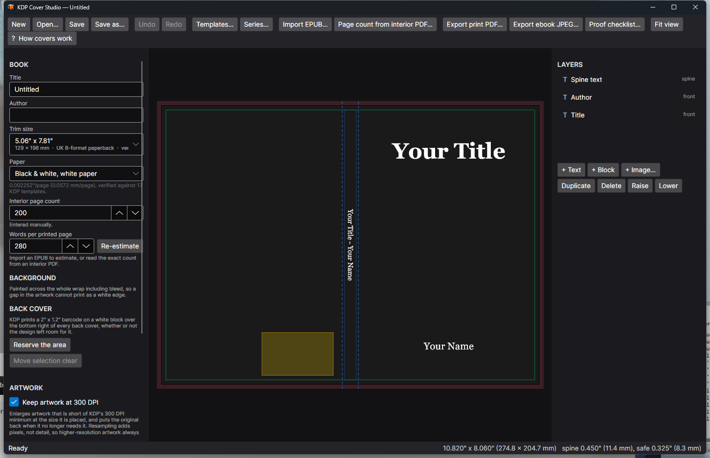
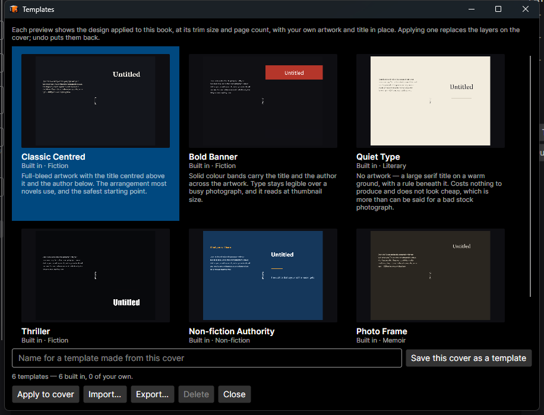
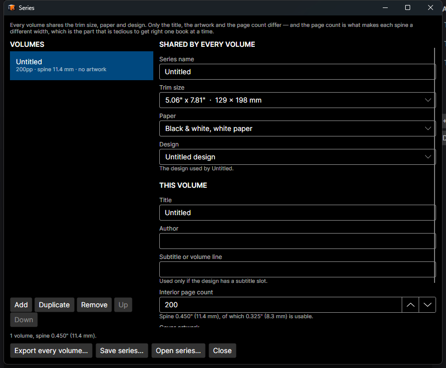
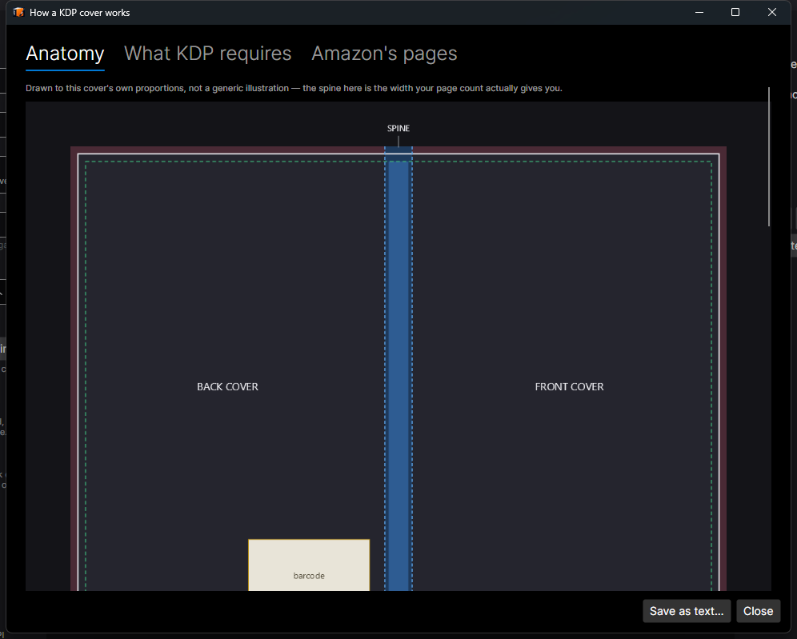

# KDP Cover Studio

A Windows desktop app for designing print-ready Amazon KDP paperback covers — back, spine and front as a single wrap — and exporting the PDF that KDP actually accepts.

**[Download the latest release »](https://github.com/raymondjstone/KDP-Cover-Studio/releases/latest)**

---

## What it does

You set the trim size, the paper and the interior page count. The app derives the wrap geometry from those — spine width, bleed, safe areas, fold tolerance, barcode reserve — and draws it to scale. You drag artwork onto a panel, set the type, and export.

The geometry is not estimated. It is derived from Amazon's own cover template PDFs and verified continuously against a corpus of 17 of them.

### Getting the spine right

`spine width = page count × paper caliper`. For KDP's black-and-white white paper that caliper is **0.002252 inches per page**, and it is identical to seven decimal places across every template in the corpus.

Several popular online spine calculators add a "+0.06 inch cover allowance". Amazon's own templates do not, and adding it shifts spine text visibly off-centre. This app does not add it.

The binding constraint on spine text is the **safe** width, not the spine width. A 200-page book has a 0.450" spine but only 0.325" you can actually set type in. The status bar shows both, always.

### Trim sizes have names

The default is 5.06" × 7.81" — which is the **UK B-format paperback**, 129 × 198 mm. The picker says so, because an author looking for a standard UK paperback is looking for "B-format", not for an inch figure that is an artefact of KDP being a US service. A5, UK Royal and A4 are named on the same basis.

Every dimension on screen carries both units: `0.450" (11.4 mm)`. There is no units toggle — a cover is designed against inch-denominated rules and printed to a paper size named in millimetres, so both numbers are wanted.

---

## Features

### Page count without guessing

| Source | Accuracy |
|---|---|
| Interior PDF | Exact, authoritative — read straight from the file |
| EPUB estimate | A **range**, never a bare number |
| Manual | Whatever you enter |

An EPUB does not contain the typography that determines page count, so an estimate carries ±20%. On a 300-page book that is ±0.135" of spine — more than double the fold tolerance. The app shows a range, keeps words-per-page editable and calibratable, and never lets an estimate look settled. Page counts outside KDP's 24–828 range raise an error rather than being silently clamped.

### Design templates

Six built-in designs, plus any you save yourself. Every preview shows the design **applied to your book** — its trim size, its page count, your artwork, your title — rendered through the same engine as the final PDF. A stock picture of a design cannot answer the only question worth asking.

Applying a template is a re-placement, not a copy: every layer is repositioned relative to its own panel, because a layout designed on a 5.06" B-format means nothing on an 8.5" one. Templates carry structure, typography and colour — never anyone else's title, and never licensed artwork.

All six built-ins cover **all three panels**. Most cover templates in the wild are a front and nothing else, which leaves you to solve the two genuinely hard parts: spine type inside the fold tolerance, and back-cover copy clear of the barcode KDP prints whether or not you left room for it.

### Series

Volumes share a trim size, paper and design; only the title, the artwork and the page count differ — and the page count is what makes each spine a different width, which is the tedious part to get right one book at a time.

Batch export **refuses one volume and still writes the rest**. Four fine and one broken is the case it exists to handle.

### Artwork at 300 DPI, automatically

Artwork short of KDP's 300 DPI minimum is resampled up to the pixels it needs at the size it is placed, and the enlargement comes back off when it is no longer needed. Three rules keep it honest:

- **Always exactly one step from the original.** Resampling a resample compounds the softening.
- **It reverts.** Shrink the image and the original comes back.
- **It stops at 4×**, and says so. Past that, interpolation invents more than it preserves — preflight goes on reporting the cover as short of 300 DPI, which is the true answer: the file is too small.

Resampling adds pixels, not detail. Preflight says so on every enlarged layer, and so does the layer panel.

### Colour

Background, text, text outline (colour *and* width) and colour blocks are all editable, each with a picker, a hex box and an eyedropper. The hex box matters: a cover often has to match a series or an imprint's palette, and those arrive as `#1E6FD9`, not as a position on a wheel.

Each picker shows a **CMYK gamut estimate inline**, at the point of decision. Being told at export that a red you chose an hour ago will print dull is true but late. The estimate returns a swatch of the likely printed colour, and says plainly that it is an estimate and not a soft proof.

The eyedropper samples the **rendered cover with guides off**, not the screen — so you cannot click your artwork and get the colour of a guide overlay. A magnifier loupe follows the pointer while it is armed.

### Live preflight

Checked continuously, not just at export:

- Artwork below 300 DPI at the size it is placed
- Spine text outside the safe width, or set below legible size
- Content colliding with the barcode reserve (with an assist that moves it clear, or refuses rather than half-solving)
- **Missing glyphs** — Skia substitutes fonts per *face*, never per glyph, so a face without an em dash draws `.notdef` and carries on. Raised as an error: there is no version of this that prints acceptably.
- Page counts outside KDP's accepted range

### Export

**Print PDF** — one page at the full wrap size, meeting KDP's cover rules:

| KDP rule | How it is met |
|---|---|
| Single PDF, back + spine + front combined | One page at the full wrap size |
| Flatten all transparencies | Split by z-order — see below |
| Embed fonts | Subset and embedded |
| No crop marks, colour bars or template text | Export builds its own options with guides off; callers cannot enable them |
| Minimum 300 DPI | Clamped up to 300 even if something asks for less |
| Optimise file size | Artwork as JPEG, text as vector — typically ~300 KB, not tens of MB |
| No file security | Nothing encrypts the output |

Transparency is flattened **without losing the type**. Rasterising the whole cover would flatten it and also destroy the text — at 300 DPI a 10pt spine title is ~42 px, permanently. Instead the stack is split by z-order: everything from the first non-opaque layer downwards composites into one opaque JPEG, and opaque text above that is drawn as real PDF text on top. No transparency anywhere, and the type stays resolution-independent.

*Worth knowing:* a translucent layer at the very top of the stack forces the whole cover to be flattened, because nothing can be lifted above it without changing what covers what. If a design loses its sharp type, look for a translucent element sitting over everything.

**Ebook cover JPEG** — a standalone front cover at the aspect ratio the store wants, with each option explained in terms of what it costs *on this book*.

**Proof checklist** — written for a **bound** copy, which is what KDP sends. Half the useful measurements only exist once the thing is folded.

### Help that is drawn to your book

The anatomy diagram is rendered from your cover's own geometry. A 90-page paperback shows a spine sliver captioned "usable 2.0 mm"; a 700-page one shows a spine wide enough to design into. Amazon's illustration shows one example and always will.

---

## Installing

1. Download `KDPCoverStudio.msi` from the [latest release](https://github.com/raymondjstone/KDP-Cover-Studio/releases/latest).
2. Run it. It installs to Program Files for all users, adds a Start menu shortcut, and registers the `.kdpcoverstudio` file type so projects open on double-click.

**Requirements: 64-bit Windows 10 or 11. Nothing else.** The installer is self-contained — the .NET runtime and all native libraries ship inside it, so there is no prerequisite to install first.

Windows SmartScreen may warn on first run, as it does for any installer that is not code-signed. Choose *More info* → *Run anyway*.

### Project files

Projects are saved as `.kdpcoverstudio` — a ZIP holding the document plus a copy of every image used, named by content hash. Your artwork is copied in, so a project survives its source images being moved, renamed or deleted, and it is one file to back up or send. The format is detected from the file's contents, not its extension, so renamed files still open.

---

## Current release

**Version 1.1.0** — `KDPCoverStudio.msi`, 40.9 MB.

### Known limitations

- **Colour is sRGB; KDP converts to CMYK.** The in-app gamut check is an estimate, deliberately generous, and is not a soft proof — that needs the printer's ICC profile.
- **Only KDP's black-and-white white paper caliper is corpus-verified.** Cream and colour stocks use Amazon's documented figures, and the app tells you which is which.
- **`/TrimBox` and `/BleedBox`** are written where the exported file's structure allows it, and skipped rather than risking a malformed file where it does not. KDP does not require them.
- **No proof has been physically printed.** Everything is verified numerically against Amazon's templates, but the final check on colour and on how the spine fold actually lands is a printed copy.

---

## Built with

C# · .NET 10 · [Avalonia 11](https://avaloniaui.net/) · [SkiaSharp](https://github.com/mono/SkiaSharp) · WiX v5

One renderer draws the editor, the raster export and the print PDF — they differ only in the canvas they are handed, so the preview cannot drift from what the printer receives.
